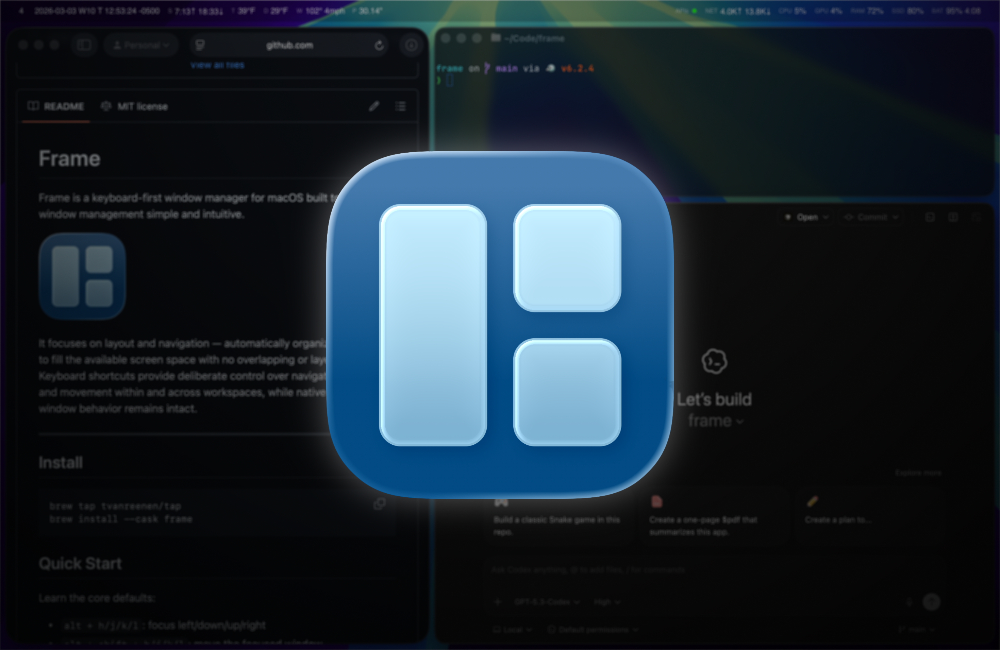

I have always liked the promise of tiling window managers: no drag-and-drop choreography, no window overlap entropy, and no constant context switch to the mouse. Windows should fill available space, adapt when state changes, and stay controllable from the keyboard.

Over the years I cycled through [spectrwm](https://github.com/conformal/spectrwm), [Spectacle](https://github.com/eczarny/spectacle), [Magnet](https://magnet.crowdcafe.com), macOS [tiling](https://web.archive.org/web/20260207124135/https://support.apple.com/guide/mac-help/tile-app-windows-mchlef287e5d/26/mac/26)/[shortcuts](https://web.archive.org/web/20260224194556/https://support.apple.com/guide/mac-help/mac-window-tiling-icons-keyboard-shortcuts-mchl9674d0b0/26/mac/26), and finally [AeroSpace](https://github.com/nikitabobko/AeroSpace). AeroSpace was by far the closest fit, but I could never make the i3-style tree model feel natural. Rearranging windows felt less like editing a layout and more like solving a puzzle.

## Close but not quite

What I wanted was intuitive and automatic layout behavior, home-row-first controls, workspaces with single/multiple-monitor flexibility, and scriptable states and callbacks, all while maintaining a native macOS feel.

No single tool gave me that exact combination.

## Why now

When software doesn't quite fit you, your mind, or your process, historically speaking, you either accepted compromises, became a contributor on someone else's project hoping your PR gets accepted, or paid the heavy cost to build your own.

For most of modern software, the hard limit has been engineering throughput. A lot of our team structures and delivery processes exist to protect that scarce bandwidth. AI tools have shifted that constraint enough that building your own is now an increasingly practical option. With this project, it felt like an interesting way to pressure-test that shift on a real problem I feel every day.

## Taking the weekend

As for the window manager, AeroSpace was close enough to be a viable base. With an MIT license and a solid architecture, it was the right place to start. I blocked off a weekend to test a simple hypothesis: find a layout model that matched how I think, then see if I could turn it into a workable, distributable solution I would actually keep using.

I ended up building what I now call [**Frame**](https://github.com/tvanreenen/frame).

## Columns, not trees

The first key design decision was replacing a recursive tree with a fixed two-level model:

- Columns across the screen
- Windows stacked within each column

No deeper nesting. No hidden structural state.

And the rules were simple:

- One window -> one column
- New window -> append to focused column
- Move window left/right across columns -> creating one if needed
- Move last window out of a column -> remove empty column
- Move up/down -> reorder inside current column

## Hands on the homerow

The second key design decision was input ergonomics. I wanted a single mental model: directional keys (`h/j/k/l`) plus modifier layering.

- `alt` + `h/j/k/l` -> focus
- `alt` + `shift` + `h/j/k/l` -> move
- `alt` + `shift` + `ctrl` + `h/j/k/l` -> resize

Workspaces use `alt` + `1-0`, and fullscreen toggles with `alt` + `F`, keeping the same base focus modifier so the system stays composable and easy to remember.

## The overhaul

I did not start from scratch. AeroSpace already nailed the hardest part: the underlying architecture. So I forked it and began to swap out tree logic.

But that quickly expanded into a broader code cleanup and functional rewrite:

- Layout engine and invariants
- Config shape and terminology
- Menu bar behavior
- UX of setup and its validation
- The overall repo structure and code patterns
- Release automation and packaging choices

At this point, being part of the fork network and syncing upstream is not realistic. That is fine. The trade-off is owning my own experience, understanding the system end to end, and being able to change it at the speed of my own needs.

## Building with AI

This project would not exist without AI-assisted development. Not because AI replaced engineering, but because it reduced mechanical overhead enough to let me spend more time on architecture and functional ergonomics.

My engineering loop with AI tools is still very much:

1. Build context (current behaviors + goals + constraints + docs)
2. Define a target change
3. Generate and inspect a candidate implementation
4. Verify behavior with manual and automated testing
5. Refine and refactor for polish, readability, and future maintenance
6. Repeat

It sounds like a lot. But those loops can happen in minutes as opposed to days or weeks. Having a thought partner in that loop let me explore the problem more deeply, more thoroughly, and faster, which gave me exposure to concepts I likely would not have reached otherwise.

## Learnings

Coming from the world of SaaS, it's always interesting to get exposure to computer science concepts you don't get to experience every day. Some of the deeper technical concepts I found most interesting from this project include:

- Daemon + CLI setup that keeps the window manager running in the background while commands come in from the terminal.
- Length-prefixed JSON over a Unix socket, so both sides can reliably tell where each message starts and ends.
- Direct window control using macOS Accessibility (AX) APIs.
- Per-app concurrency control for AX calls, keeping operations safe, predictable, and cancellable instead of race-prone.
- Keeping a consistent internal layout model by regularly normalizing column/window state (invariant-driven design).
- Broader practical Swift experience across real-world systems code (async workflows, strong typing, testing, and app/CLI integration).
- Full packaging and distribution flow through a Homebrew tap.

For me, Frame was a useful and meaningful experiment: instead of settling for the closest fit, I built the thing I actually wanted to use. Whether Frame itself is useful to you matters less than what it represents. The dynamics of building software are changing, and that opens up a real opportunity. It is worth asking where you are still adapting yourself to tools, when you could be shaping the tools around the way you actually work. It is also a good moment to get under the hood and push yourself to learn, because in a code-generated world, computer science fundamentals and system design are even more important skills for the person managing the code-generating machine.
