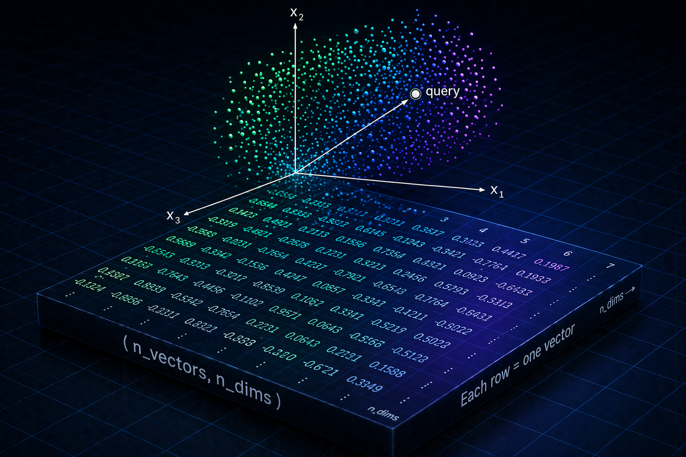

I built [numpy-vector-store](https://github.com/tvanreenen/numpy-vector-store) after two things collided: watching teams deploy full vector store infrastructure for genuinely modest workloads, and realizing that maybe there's a vastly simpler option.

### How It Started: Two Things Colliding

I'd been spending a lot of time with vector databases — mostly Qdrant and Postgres with pgvector. Great tools. But I kept noticing a gap between what I was reaching for and what I actually needed.

At the same time, at work, I kept watching us spin up separately deployed vector store services — and then immediately start worrying about replicas and concurrency for what were genuinely small workloads. An AI agent with modest usage doesn't need a multi-replica vector service. The weight of the solution felt completely disconnected from the size of the problem.

Meanwhile, I was writing a blog post on embeddings — how they work, what they represent, why they're useful — and I was doing most of that exploration in NumPy and Jupyter. That's when the obvious thing became obvious: I was already doing vector search. I had a matrix of embeddings. I was computing dot products. I was slicing arrays based on metadata. It wasn't a vector database. But it was close enough to make me ask: how far away is it, really?

That question turned into a benchmarking exercise. The benchmarking exercise turned into a library.

### What Is an Embedding, Exactly?

Before getting into the implementation, it's worth being precise about the input material. I've written a [more in-depth guide to embeddings](https://tim.vanreenen.me/posts/embeddings/) if you want to go deeper — but here's the foundation you need for what follows.

An embedding is a dense vector — a fixed-length array of floating point numbers — that encodes semantic meaning. When you pass a sentence through a model like `text-embedding-3-small` or a Sentence Transformer, you get back something like `[0.032, -0.14, 0.87, ...]` with hundreds or thousands of dimensions. Those numbers aren't computed by any explicit formula — they're the product of training, where the model learned to position similar concepts close together in this high-dimensional space by exposure to vast amounts of text. The remarkable result is that semantic similarity maps to geometric proximity: sentences that mean similar things end up near each other.

"Near" is measured with cosine similarity — not the literal spatial distance between endpoints (that's Euclidean distance), but the angle between vectors: how precisely are they pointing in the same direction? It scores from -1 to 1, where 1 is identical, 0 is unrelated, and magnitude is irrelevant. There's a handy shortcut hiding in this too: pre-normalize your vectors to unit length and the formula collapses to a plain dot product — something we'll take full advantage of shortly.

```
cos(θ) = (q · v) / (‖q‖ × ‖v‖)
```

### The Core Search: Matrix Multiplication in Disguise

Here's the shortcut in practice. If every stored vector is pre-normalized to unit length at insertion time, its magnitude is always 1 — so the denominator in the cosine formula is always 1, and it drops out entirely. Similarity between a normalized query and a matrix of normalized vectors is just a dot product:

```python
# Normalize at insertion time (once, up front)
norms = np.linalg.norm(vectors_2d, axis=1, keepdims=True)
normalized_vectors = vectors_2d / norms

# At search time: one matrix multiply to score everything
query_norm = query / np.linalg.norm(query)
similarities = np.dot(normalized_vectors, query_norm)
```

That single `np.dot` call scores every vector in the store against your query simultaneously. NumPy dispatches this to BLAS (Basic Linear Algebra Subprograms) — highly optimized C routines that operate on multiple values in parallel at the CPU instruction level, far faster than anything a Python loop could achieve.

This is the O(n) brute-force approach — no index, no approximation. Every search scans every vector. That's fine when n is small, but as the dataset grows the cost grows linearly with it. Dedicated solutions like Qdrant or FAISS solve this with ANN (Approximate Nearest Neighbor) indexing — data structures like HNSW that let you skip the majority of comparisons by navigating a graph, trading a tiny amount of accuracy for orders-of-magnitude speed gains. That's where they earn their place. For moderate scales, the brute-force path is fast, exact, and dead simple.

How moderate? Here are measured timings on Apple M2:

| Embedding Type | Dimensions | ~5ms | ~25ms | ~100ms | ~500ms |
|----------------|------------|------|-------|--------|--------|
| Sentence Transformers | 384 | 1K vectors / 1.5MB | 10K vectors / 15MB | 100K vectors / 147MB | 500K vectors / 732MB |
| OpenAI Small | 1536 | 500 vectors / 3MB | 5K vectors / 29MB | 25K vectors / 147MB | 100K vectors / 586MB |
| OpenAI Large | 3072 | 200 vectors / 2MB | 2.5K vectors / 29MB | 5K vectors / 59MB | 25K vectors / 293MB |

100K OpenAI Small embeddings in under 100ms, from a ~147MB in-memory array — no network round trips, no service to deploy. For a lot of real use cases, that table is a complete architecture decision.

### Metadata: Flexible vs. Structured

The vector itself only gets you to "similar." To be useful, you need to know *what* those similar vectors represent. Every vector needs metadata — a title, a source URL, a document ID, a category — so search results are actionable.

The library supports two approaches, and the tradeoff is interesting.

#### The Flexible Path

By default, metadata is stored in a NumPy object array — an array where each element is a plain Python dict. No schema required.

```python
store = VectorStore(dimensions=1536)
store.add_vectors(
    embeddings,
    np.array([
        {"title": "Introduction to RAG", "source": "blog"},
        {"title": "Vector Indexing Strategies", "source": "paper"},
    ])
)
```

This is maximally convenient. Each metadata dict can have different keys. You can iterate it, filter it, attach whatever you want. The cost is that filtering requires Python-level iteration — a `for` loop or a list comprehension rather than a vectorized operation.

#### The Structured Path

If you define a schema upfront, metadata becomes a NumPy structured array — a typed, columnar layout where each field is a named, contiguous memory region.

```python
store = VectorStore(
    dimensions=1536,
    metadata_schema={'title': 'U200', 'year': 'i4', 'citations': 'i4'}
)
```

Now metadata behaves like a typed DataFrame column. Filtering is vectorized:

```python
# Boolean mask across the entire array — no Python loop
recent_and_cited = (store.metadata['year'] >= 2023) & (store.metadata['citations'] > 50)
filtered_vectors = store.vectors[recent_and_cited]
```

NumPy evaluates this with C-level operations across the entire array in one pass. For pre-search filtering — reducing the candidate set before computing similarities — this is substantially faster than the object array path.

The lesson here is a familiar one from database design: schema flexibility comes at a performance cost. The right choice depends on your access patterns.

### Persistence: Fitting a Lot in a Small Box

One part of this project that genuinely surprised me was how efficiently you can serialize a vector store.

NumPy's `.npz` format stores multiple arrays in a zip-compressed binary container. Because floating point embeddings are high-entropy data (lots of varied values), compression ratios aren't dramatic — but the binary format itself is compact. Float32 is 4 bytes per dimension, so a 1536-dimensional vector costs exactly 6KB. Ten thousand of them is 60MB. That isn't nothing, but it's a file you could ship inside a container image, load entirely into memory at startup, and search in under 5ms.

```python
# Save
np.savez_compressed("vectors.npz", vectors=vectors_array, metadata=metadata_array)

# Load
data = np.load("vectors.npz", allow_pickle=True)
```

The `allow_pickle=True` flag deserializes the metadata object array, which stores Python dicts via pickle. The structured array path avoids pickle entirely, using NumPy's native binary dtype serialization instead — faster to load, more portable.

The context manager makes the persistence lifecycle clean:

```python
with VectorStore(dimensions=1536, file_path="vectors.npz") as store:
    store.load()
    store.add_vectors(new_embeddings, new_metadata)
# Automatically saves on exit
```

### The Architectural Lesson

The most useful thing this project taught me wasn't technical. It was about solution sizing.

There's a spectrum of vector search solutions. At one end: Qdrant, Pinecone, Weaviate, pgvector — full-featured systems with rich APIs, filtering, metadata indexing, horizontal scaling, managed services. At the other: this library, or even just raw NumPy in a Jupyter notebook. In between: SQLite with vector extensions, LanceDB, ChromaDB.

The mistake I kept seeing — in my own work and watching others — was reaching toward the high end of that spectrum by default. Not because the use case required it, but because it felt more "serious" or even worse, that's what an LLM recommended. Running Qdrant signals that you take your vector search seriously. Running in-memory NumPy arrays feels like a prototype.

But if you have 50,000 document embeddings that serve a single internal tool, "serious" might mean 40MB `.npz` file loaded at container startup, zero external dependencies, and sub-10ms P99 latency — not a separately managed database service with its own scaling policy, connection pool, and on-call rotation.

The question worth asking first is: what's the actual scale? What are the real latency requirements? Is there more than one process writing to this store? Does it need to survive a restart? Depending on the answers, the right tool might surprise you.

### Using It

```bash
uv add numpy-vector-store
```

```python
import numpy as np
from numpy_vector_store import VectorStore

store = VectorStore(dimensions=1536, file_path="vectors.npz")
store.load()

query = embed("what is retrieval augmented generation?")  # your embedding function
results = store.search(query, top_k=5)

for index, score, meta in results:
    print(f"{meta['title']} ({score:.3f})")
```

The full source is on [GitHub](https://github.com/tvanreenen/numpy-vector-store). It's deliberately small — one file, one class, a handful of methods. If you find the techniques more useful than the library itself, that's completely fine. The NumPy primitives are all standard: `np.dot`, `np.linalg.norm`, `np.savez_compressed`, structured dtypes. There's nothing here you couldn't replicate in an afternoon once you understand what it's doing.

That understanding was the whole point.
